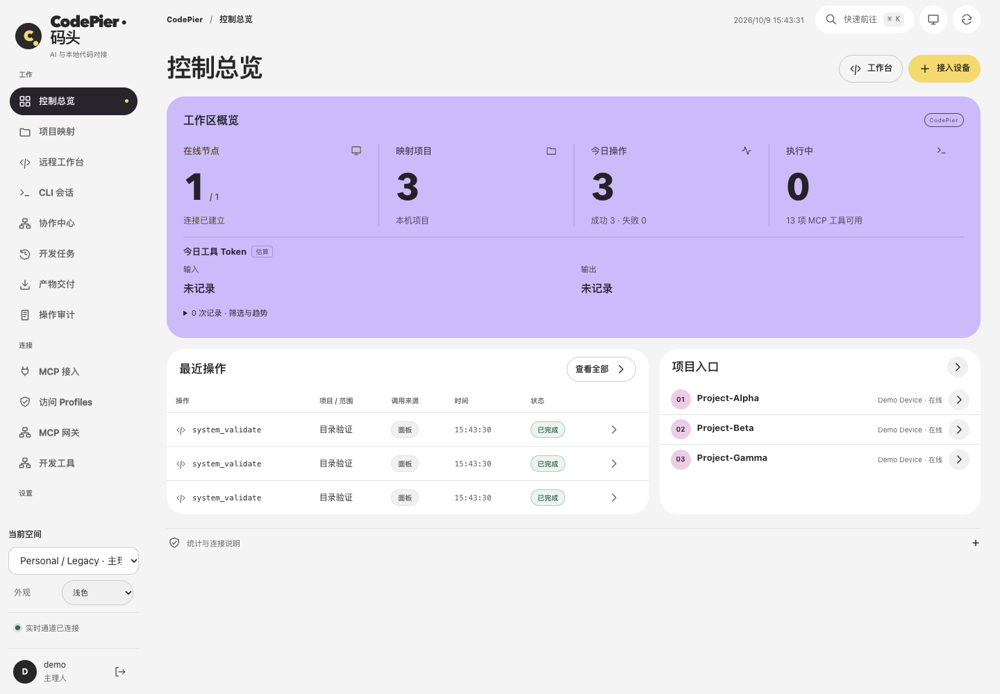

# CodePier · 码头

让 ChatGPT 直接使用你的开发电脑：读代码、改文件、跑测试。

[](RELEASE.json)
[](LICENSE)

CodePier 是自托管的 MCP 服务和开发面板。**Hub** 负责接入与管理，**Agent** 在 macOS、Windows 或 Linux 上运行本机工具。你也可以在网页里继续 Pi、Codex、Claude Code 会话，管理多台电脑和服务器。

项目留在原来的电脑上，开发电脑无需开放公网入站端口。读取的源码、命令结果和会话记录会按使用流程传给 Hub 或客户端。

[快速开始](#5-分钟快速开始) · [使用文档](docs/README.md) · [版本下载](https://github.com/cyeinfpro/codepier/releases/latest)



界面示例使用独立合成数据。

## 5 分钟快速开始

下面是最短接入流程。首次镜像构建、下载和 HTTPS 配置可能需要更久；已有 Hub 可从第 2 步开始。

### 1. 安装 Hub

服务器需准备 Git、Bash、Python 3.9+、Docker 和支持 `up --wait` 的 Docker Compose v2。以下安装已发布的稳定版 **v1.22.0**，最新正式版本见 [Releases](https://github.com/cyeinfpro/codepier/releases/latest)：

```bash
git clone --branch v1.22.0 --depth 1 https://github.com/cyeinfpro/codepier.git
cd codepier
bash install.sh
```

按提示设置地址和管理员账号，完成后打开面板登录。没有默认管理员密码。

以上默认生成 HTTP 配置，仅适合可信网络。**公网使用前先配置 HTTPS，不要通过裸公网 HTTP 输入密码或配对设备。** 详细步骤见[安装教程](docs/START-HERE.md)。

### 2. 接入开发电脑

在面板打开 **设备节点 → 接入电脑**，选择系统，填写设备名称和已有的授权目录，将生成的命令复制到这台电脑的终端执行。

完成后确认设备在线。命令含一次性配对票据，不要公开分享。只需文件访问时，取消勾选“Shell 与目录任务”。[各系统安装说明](docs/AGENT_INSTALL.md)

### 3. 添加项目

在 **项目映射** 中选择设备，填写项目名称（如 `demo`）和授权目录内的实际路径。先开启读取，确认能打开一个文件；需要改代码、跑测试时，再开启写入和执行权限。

### 4. 连接 ChatGPT

在 **系统设置 → 公开地址** 保存实际 HTTPS 基地址，再在 ChatGPT 中添加 MCP 连接：

```text
https://你的域名/mcp
```

通过 OAuth 登录 CodePier，确认项目和工具权限。在新对话里启用 CodePier，试试：

> 打开 demo 项目，读取 README，告诉我项目结构和测试入口。先不要修改文件或运行命令。

具体客户端入口、私有 Hub 和其他 MCP 客户端的配置见[连接指南](docs/CHATGPT.md)。只使用网页里的 CLI 会话，可跳过这一步。

## 核心能力

- **处理真实项目**：搜索和修改文件、审阅差异、运行测试，用 worktree 隔离工作目录。
- **继续本机会话**：在网页中使用 Pi、Codex 或 Claude Code，查看历史、发送附件、处理审批。
- **管理电脑与服务器**：一台 Hub 连接多台 Agent，通过项目使用已分配的 VPS。
- **追踪执行结果**：查看任务状态、输出和退出码，断线后查询原操作，避免重复执行。
- **按需授权**：控制项目和工具权限，使用团队 Space、角色和已审核的外部 MCP 工具。

CodePier 不提供模型服务。只使用 MCP 文件与命令工具，不需要安装模型 CLI；使用原生会话时，需在 Agent 电脑上自行安装、登录相应 CLI，模型费用沿用其配置。

## 使用前了解

- **Shell 和原生 CLI 使用 Agent 运行账号的系统权限，不是项目目录沙箱。** 只授权必要目录；互不信任的用户应使用独立系统账号、容器或虚拟机。[安全说明](SECURITY.md)
- 浏览器与桌面控制需另行配置和授权。桌面控制当前已验证 macOS，Windows / Linux 桌面后端尚未验证。[配置说明](docs/COMPUTER_USE.md)
- 文件入站未配置时默认开启，显式关闭会保留；来源授权不会自动扩大。支持范围、大小限制和客户端验收状态见[文件入站指南](docs/FILE_IMPORT_INGRESS.md)。协作室默认关闭，启用前阅读[协作室指南](docs/COLLABORATION_CHATROOM.md)。

## 更新与备份

Hub 与 Agent 分别升级，发布新版本不会自动更新你的部署。更新前备份数据库及匹配的密钥；回退也必须使用匹配版本的备份。

[更新 Hub](docs/PANEL_UPDATE.md) · [升级 Agent](docs/AGENT_INSTALL.md) · [备份 Hub 数据](docs/PANEL_UPDATE.md#备份-hub-数据)

## 更多文档

- [使用文档](docs/README.md)：设置、CLI 会话、VPS、工具与排错
- [开发与验证](docs/DEVELOPMENT.md) · [贡献指南](CONTRIBUTING.md)
- [更新记录](CHANGELOG.md) · [问题反馈](https://github.com/cyeinfpro/codepier/issues)

## 版本与许可

当前仓库的 `RELEASE.json` 标记为 **1.22.1 / prepared / source-and-image**；可下载版本以 [Releases](https://github.com/cyeinfpro/codepier/releases/latest) 为准，`main` 可能包含尚未发布的改动。

- **Version:** 1.22.1
- **License:** [MIT](LICENSE)

第三方依赖保留各自许可证，见 `web/vendor/` 与 [MCP Apps 声明](web/mcp-apps/THIRD_PARTY_NOTICES.txt)。
