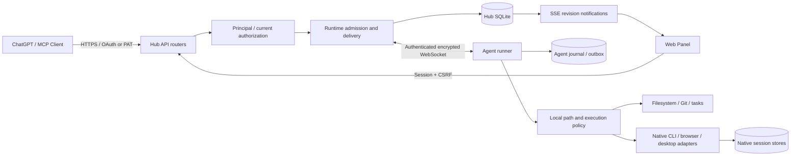

# CodePier 架构与一致性边界

CodePier 将远程调用入口与真正访问项目的机器分开。Hub 负责身份、授权、设备连接、项目映射和持久回执；Agent 在所有者的系统账号下执行，并再次检查本机权限。一次网络请求、一项持久操作和一个原生 CLI 会话是三个不同的生命周期。

## 模块与数据流



`hub/app.py` 是组合入口：加载配置、创建 Store/Runtime、注册生命周期与路由；`hub/api/` 分离认证、项目设备、操作活动、系统、事件等接口。`hub/principal.py` 不依赖 Runtime，承载身份与范围解析；授权不能仅依赖长连接建立时保存的旧对象。工具契约以 `shared/contracts.py` 及各扩展契约为准，`MUTATING`、`PROCESS_TOOLS` 是可执行策略集合，不是额外维护的第二份工具目录。

`shared/config.py` 和 `hub/config.py` 统一数值、有限值、CSV 空白、时区等解析。无效配置在启动阶段明确失败，不把 NaN、空白列表或不合法时区带到运行期。模块需要回指组合对象时使用类型协议或显式注入；工具注册、CLI 和可选平台适配的少量惰性导入属于组合边界，不应散落到普通业务函数来掩盖循环依赖。

## Store 所有权与事件循环

Hub 主 SQLite 连接使用可重入的所有权锁；连接、游标执行和取数必须处于受保护区。嵌套写入只允许最外层提交；内层异常使外层事务进入只回滚状态，调用者即使捕获内层异常也不能意外提交部分修改。已有显式事务保留原边界，不在通用锁入口盲目插入 BEGIN，否则会破坏工作流等调用者的手动事务。

异步请求经 `Store.run` 提交到单线程工作器，在线程内完成同步 SQLite 工作和复合权限检查；不得持锁等待异步任务。取消请求时等待已提交数据库工作安全结束，不能把仍在运行的工作器遗留为新的并发写入者。`hub/db_worker.py` 为同步处理器提供统一桥接，避免阻塞 WebSocket 心跳和 SSE 事件循环。

SSE 队列只在其所属事件循环操作。工作器的提交通知通过线程安全调度返回该循环；提交后发布，不把未提交状态暴露给界面。安全相关表变更推进权限修订号，SSE 在修订变化或定期复核时重新认证，不为每一条普通事件反复查询会话。队列满、关闭或跨会话的迟到事件不会扩展权限。

健康检查区分正在关闭和数据库不可用；后台投递、迁移异常保留有界的非敏感错误线索，不将异常吞掉后继续报告成功。Hub 实例锁也被离线密钥维护使用，防止运行中直接改写加密数据。

## 持久操作、幂等与未知结果

```mermaid
sequenceDiagram
  participant C as Client
  participant H as Hub
  participant D as Hub Store
  participant A as Agent
  participant J as Journal
  C->>H: tool + arguments + idempotency key
  H->>D: validate current permission; persist request
  H-->>C: operation_id (possibly pending)
  H->>A: same operation_id + tool epoch
  A->>J: admit or recover prior receipt
  A->>A: local policy; execute once
  A->>J: durable result and outbox
  A->>H: result
  H->>D: persist terminal result
  H-->>A: ACK
  C->>H: operations_wait(original id)
  H-->>C: stored result
```

Hub 的 admission 在写入前核对凭据、项目和设备状态；投递前再次检查排队期间是否撤权或改映射。幂等键绑定操作者和请求指纹，不允许相同键对应不同参数。Agent 用独立 journal 防止重复执行并补传结果。ACK 表示 Hub 已保存结果，不代表浏览器已展示，也不代表某个独立生命周期助手已经完成最终服务切换。

连接中断可能发生在副作用完成、回执保存之前。此时必须查询或 probe 原编号，不能把“没有收到响应”翻译为“没有执行”。已投递的操作遇到新权限或版本不兼容时仍保留恢复途径；不确定写入不会在另一个语义版本下重新解释。

## 工具协议与混合版本

加密、delivery-v2、原生 CLI 和工具语义协议各自版本化。新握手携带发布版本、catalog SHA-256 和逐工具 wire epoch。catalog 摘要只表示目录身份，不是签名；新增无关工具导致的摘要变化不会阻止原有兼容工具。

`shared/tool_protocol.py` 显式维护有破坏性语义变更的工具 epoch 和最低版本。旧握手固定兼容 epoch 1；不兼容的新调用被拒绝。Hub 将 epoch 与加密请求一起持久保存，升级后不把旧请求自动标成新 epoch。旧回执可继续查询；已投递但未确认的请求只做恢复探测。兼容测试覆盖新旧 wire 形状的四种组合、实际加密、文件写入和 journal 防重放；它不是运行过所有历史二进制的证明。

## 为什么原生会话使用独立数据库

`hub/native_cli.py`、Agent journal 及原生会话历史有自己的 SQLite 连接、锁和生命周期。它们不与 Hub 主 Store 构成跨库 ACID 事务。原生进程可能在浏览器断开后继续运行，消息同步通过持久编号、控制回执和恢复查询实现最终一致，而不是在主库事务中等待外部进程。

原生控制的 `pending` 是内存中的连接/future 映射，最多 64 个并发请求，单次等待 15 秒，退出等待时从映射移除。它不是主库 `operations` 的持久队列，Hub 重启不会恢复原 future。目录查询超时可重新发起只读查询；其他控制请求的回执丢失必须先按同一会话/输入编号核对原生状态，不能由“pending 不在内存中”推断未执行。

因此，删除网页记录不等于删除原生历史，提交控制请求不等于原生已接受，主库备份也不能冒充所有原生数据库的一致性快照。需要完整灾备时，暂停相关写入并按部署方式备份完整状态卷和 Agent 状态，再在隔离副本验证。不要为了统一数据层而把所有连接机械合并到一个长事务。

## 网页和构建边界

`web/core/*.mjs` 提供 UI 原语、显式动作注册、页面生命周期与被动快照节点复用，构建为 `core/bundle.js` 的 CP 接口供现有功能脚本使用。这是渐进迁移，不声称所有历史模块已改成纯 ES Module。编辑器、聊天草稿、原生流和持久更新监视器保留自己的状态边界；离开视图不能取消已经提交的持久操作。

HTML 入口由 `index.source.html`、单一 VERSION 和真实内容哈希生成。启动时校验清单并冻结带哈希资源的字节，正确身份才允许 immutable 缓存；旧地址继续重新验证。前端构建后必须重新生成清单，发布检查拒绝过期产物。

公开源码包使用显式文档白名单和文件校验，不打包密钥、数据库、环境、私人验收记录或字体。依赖锁定包含传递依赖与 SHA-256，Docker 基础镜像固定多架构摘要。开发分层、完整分片合并和证据范围见 [开发与验证](DEVELOPMENT.md)，安全边界见 [SECURITY](../SECURITY.md)。
